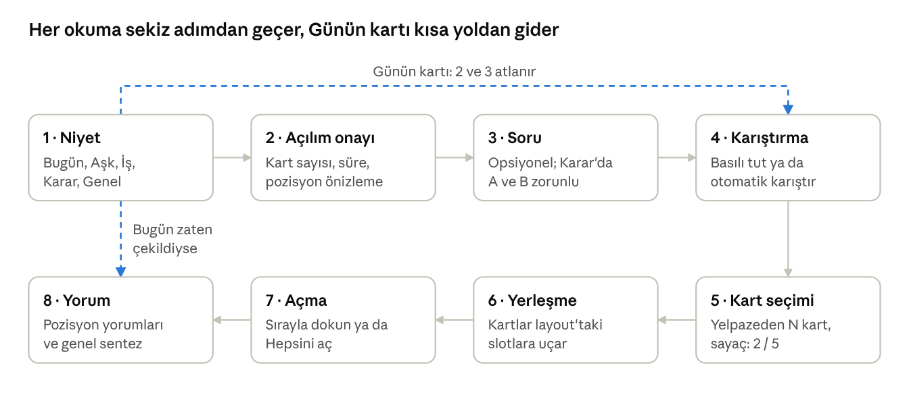

# Tarot Okuma Akışı — Ürün ve UI Spec

29 Eylül 2026 · @KaanLovie

## Özet

Bu spec, kullanıcının ne öğrenmek istediğini seçip kartları kendi eliyle çektiği, animasyonlu bir tarot okuma akışını tanımlar. V1'de altı açılım (spread) var: Günün kartı, Üç kart, İlişki, Karar, Kariyer / Para ve Celtic Cross. Kart anlamları ve kombinasyon kuralları "Tarot Rehberi" dokümanından gelir; bu spec akışı, ekranları, animasyonları ve veri modelini kapsar.

### Hedefler

- Kullanıcı, açılım terminolojisini bilmeden doğru okumaya iki dokunuşta ulaşır: niyet seç → başla.
- Kart çekmek bir ritüel gibi hissettirir: karıştırma, yelpaze, kendi seçimi, kartları tek tek açma.
- Günün kartı günlük geri dönüş alışkanlığı yaratır.
- Her okuma, pozisyona özel yorumlar ve tüm kartları bağlayan bir genel sentezle biter.

### Kapsam dışı (v1)

- İnsan okuyucuyla canlı görüşme
- Kullanıcının kendi açılımını tasarlaması
- Sosyal akış ve okumalara yorum yazma
- Ödeme altyapısı (ücretsiz / premium ayrımı açık sorulardadır)

### Başarı metrikleri

| Metrik | Tanım |
| --- | --- |
| Flow completion | Niyet seçenlerin yorum ekranına ulaşma oranı |
| Adım bazında drop-off | Her ekranda akışı terk edenlerin oranı |
| Günün kartı D1 / D7 | Günün kartını açanların ertesi gün ve 7 gün içinde tekrar açma oranı |
| Detaylı okuma payı | Tüm okumalar içinde Celtic Cross oranı |
| Paylaşım oranı | Yorum ekranından paylaşım yapan okumaların oranı |

## Kullanıcı akışı

Tüm açılımlar aynı sekiz adımlık akışı kullanır; açılıma göre değişen yalnızca kart sayısı, soru girişi ve slot yerleşimidir.



Günün kartı onay ve soru adımlarını atlar. Aynı gün ikinci kez açılırsa kart yeniden çekilmez; kayıtlı okuma doğrudan gösterilir.

### Navigasyon kuralları

- **Adım 1–3:** Geri tuşu serbestçe bir önceki adıma döner; girilen soru korunur.
- **Adım 4 ve sonrası:** Geri tuşu "Okumayı bırakmak istediğine emin misin?" onayı açar. Kart seçimi başladıktan sonra okuma geri alınamaz; bu, ritüel hissini ve sonucun tek seferli olmasını korur.
- **Yarıda bırakma:** Kartlar seçildiyse ama yorum açılmadıysa okuma taslak olarak saklanır. Kullanıcı döndüğünde "Yarım kalan okuman var" kartıyla kaldığı yerden devam eder.
- **Geçmiş:** Tamamlanan her okuma, tarih ve soruyla birlikte "Okumalarım" listesine eklenir.

## Açılımlar

Kullanıcı açılım adını değil niyetini seçer; sistem niyeti bir açılıma eşler. Celtic Cross'a "Genel" niyetinin "Detaylı okuma" seçeneğinden ya da "Tüm açılımlar" listesinden ulaşılır.

| Niyet (ekranda) | Açılım | `id` | Kart | Süre etiketi | Soru girişi |
| --- | --- | --- | --- | --- | --- |
| Bugün | Günün kartı | `daily` | 1 | 1 dk | Yok |
| Genel | Üç kart | `three` | 3 | 2 dk | Opsiyonel |
| Genel → Detaylı | Celtic Cross | `celtic` | 10 | 8 dk | Opsiyonel, önerilir |
| Aşk | İlişki | `relationship` | 5 | 4 dk | Opsiyonel soru + opsiyonel kişi adı |
| Karar | Karar (İki yol) | `decision` | 5 | 4 dk | A ve B seçenekleri zorunlu |
| İş / Para | Kariyer / Para | `career` | 5 | 4 dk | Opsiyonel |

**Slot koordinatları:** Değerler slot birimindedir; 1 birim = bir kart hücresi (kart + boşluk). (0, 0) sol üst hücrenin merkezidir. Renderer tüm layout'u kapsayıcıya sığacak şekilde ölçekler. `rot` derece cinsindendir. Tablolardaki sıra, kartların seçilme, yerleşme ve açılma sırasıdır.

### Günün kartı (`daily`)

| # | `key` | Etiket | Slot (x, y, rot) | Pozisyon sorusu |
| --- | --- | --- | --- | --- |
| 1 | `today` | Bugünün teması | (0, 0, 0) | Bugün hangi enerjiye odaklanmalıyım, ne tavsiye ediliyor? |

### Üç kart (`three`)

| # | `key` | Etiket | Slot (x, y, rot) | Pozisyon sorusu |
| --- | --- | --- | --- | --- |
| 1 | `past` | Geçmiş | (0, 0, 0) | Bu durumu buraya getiren ne? |
| 2 | `present` | Şimdi | (1, 0, 0) | Şu an ne oluyor? |
| 3 | `future` | Gelecek | (2, 0, 0) | Mevcut gidişat nereye varıyor? |

### İlişki (`relationship`)

Artı şeklinde: Sen solda, O sağda, bağ ortada, engel altta, potansiyel üstte.

| # | `key` | Etiket | Slot (x, y, rot) | Pozisyon sorusu |
| --- | --- | --- | --- | --- |
| 1 | `self` | Sen | (0, 1, 0) | Bu ilişkide senin enerjin ve tutumun ne? |
| 2 | `other` | O | (2, 1, 0) | Karşı tarafın ilişkiye getirdiği enerji ne? |
| 3 | `bond` | Aradaki bağ | (1, 1, 0) | İlişkinin şu anki doğası ne? |
| 4 | `obstacle` | Engel | (1, 2, 0) | Önünüzdeki zorluk ne? |
| 5 | `potential` | Potansiyel | (1, 0, 0) | İlişki hangi yöne gelişebilir? |

Kişi adı girildiyse "O" etiketi o adla gösterilir (ör. "Deniz"). Yorumlar karşı tarafın ne düşündüğünü iddia etmez; onun ilişkiye getirdiği enerjiyi anlatır.

### Karar — İki yol (`decision`)

Durum üstte ortada; iki yol aşağı doğru ikiye ayrılır.

| # | `key` | Etiket | Slot (x, y, rot) | Pozisyon sorusu |
| --- | --- | --- | --- | --- |
| 1 | `situation` | Durum | (1, 0, 0) | Kararın özü ve şu anki tablo ne? |
| 2 | `a_path` | A yolu | (0, 1, 0) | A'yı seçersen süreç nasıl gelişir? |
| 3 | `a_outcome` | A sonucu | (0, 2, 0) | A seçeneği nereye varabilir? |
| 4 | `b_path` | B yolu | (2, 1, 0) | B'yi seçersen süreç nasıl gelişir? |
| 5 | `b_outcome` | B sonucu | (2, 2, 0) | B seçeneği nereye varabilir? |

"A" ve "B" etiketleri kullanıcının girdiği seçenek adlarıyla değiştirilir (ör. "İstanbul'da kal" / "Berlin'e taşın").

### Kariyer / Para (`career`)

Tek sıra, soldan sağa beş kart.

| # | `key` | Etiket | Slot (x, y, rot) | Pozisyon sorusu |
| --- | --- | --- | --- | --- |
| 1 | `current` | Mevcut durum | (0, 0, 0) | İşte ya da parada şu an ne oluyor? |
| 2 | `obstacle` | Engel | (1, 0, 0) | Önündeki en büyük engel ne? |
| 3 | `strength` | Güçlü yan | (2, 0, 0) | Hangi gücüne dayanabilirsin? |
| 4 | `advice` | Tavsiye | (3, 0, 0) | Ne yapmalısın? |
| 5 | `outcome` | Gidişat | (4, 0, 0) | Bu yolda devam edersen nereye varırsın? |

### Celtic Cross (`celtic`)

Solda haç (6 kart), sağda aşağıdan yukarı okunan dört kartlık sütûn. Waite'in 1910 sıralaması kullanılır.

| # | `key` | Etiket | Slot (x, y, rot) | Pozisyon sorusu |
| --- | --- | --- | --- | --- |
| 1 | `present` | Mevcut durum | (1, 1.5, 0) | Sorunun kalbinde ne var? |
| 2 | `challenge` | Kesen kart | (1, 1.5, 90) | Duruma karışan güç ya da engel ne? |
| 3 | `crown` | Taç | (1, 0.5, 0) | Bilinçli hedef ya da ulaşılabilecek en iyi sonuç ne? |
| 4 | `root` | Temel | (1, 2.5, 0) | Durumun altındaki kök sebep ne? |
| 5 | `past` | Yakın geçmiş | (0, 1.5, 0) | Geride kalan etki ne? |
| 6 | `future` | Yakın gelecek | (2, 1.5, 0) | Yakında ne geliyor? |
| 7 | `self` | Sen | (3.4, 3, 0) | Bu durumda tutumun ne? |
| 8 | `environment` | Çevre | (3.4, 2, 0) | Çevrendeki insanlar ve dış etkiler ne? |
| 9 | `hopes_fears` | Umutlar ve korkular | (3.4, 1, 0) | Neyi umuyor, neden korkuyorsun? |
| 10 | `outcome` | Sonuç | (3.4, 0, 0) | Gidişat devam ederse nereye varılır? |

Kesen kart (2), mevcut durum kartının (1) üzerine 90° döndürülmüş olarak biner; ikisine de ayrı ayrı dokunulabilmesi için kesen kartın dokunma alanı dönük kartın görünen uçlarıdır. 375 px'ten dar ekranlarda layout, sağdaki sütûn haçın altına yatay bir sıra olarak taşınarak dikey düzene geçer.

## Ekranlar

Her ekran için bileşenler, durumlar ve mikro metinler. Tırnak içindeki metinler ekranda görünecek kopyadır.

### 1. Niyet ekranı

- **Başlık:** "Bugün ne öğrenmek istiyorsun?"
- **Beş niyet kartı:** Mobilde 2 sütunlu grid, masaüstünde tek sıra. Her kartta ikon, başlık, alt metin ve bir chip ("5 kart · 4 dk").

| Niyet | Alt metin | Chip |
| --- | --- | --- |
| Bugün | "Günün enerjisi ve tavsiyesi" | "1 kart · 1 dk" |
| Aşk | "İlişkin ve duyguların" | "5 kart · 4 dk" |
| İş / Para | "Kariyer, iş ve maddi konular" | "5 kart · 4 dk" |
| Karar | "İki seçenek arasında kaldıysan" | "5 kart · 4 dk" |
| Genel | "Hayatına genel bir bakış" | "3 kart · 2 dk" |

- **Durum — günün kartı çekildi:** "Bugün" kartında çekilen kartın küçük görseli ve "Bugün çekildi" rozeti görünür; dokununca kayıtlı yorum açılır.
- **Durum — yarım okuma:** Ekranın üstünde "Yarım kalan okuman var · Devam et" banner'ı.
- **Alt link:** "Tüm açılımları gör" → altı açılımın kart sayısı ve süresiyle listesi.

### 2. Açılım onayı

- **Başlık:** Açılım adı; altında "5 kart · yaklaşık 4 dakika".
- **Layout önizlemesi:** Boş slotlar kesikli çerçeve olarak, açılımın gerçek düzeninde çizilir; her slotun altında pozisyon etiketi.
- **Pozisyon listesi:** Numaralı, her biri tek satır açıklamalı.
- **Genel niyetinde segmented control:** "Hızlı · 3 kart" / "Detaylı · 10 kart". Seçim değişince önizleme animasyonla yeni layout'a dönüşür.
- **CTA:** "Devam"; ikincil link "Başka açılım seç".

### 3. Soru

- **Başlık:** "Sorunu yaz" ve altında "İsteğe bağlı".
- **Textarea:** En fazla 200 karakter, sayaçlı. Placeholder açılıma göre değişir: Üç kart "Bu dönem bana ne getirecek?", İlişki "Bu ilişki nereye gidiyor?", Kariyer "Yeni iş teklifi hakkında neyi bilmeliyim?", Celtic Cross "Hayatımda şu an en çok neye odaklanmalıyım?".
- **İpucu satırı:** "Açık uçlu sorular daha iyi okunur: 'Olacak mı?' yerine 'Neye dikkat etmeliyim?'"
- **Karar açılımı:** İki zorunlu alan, "A seçeneği" ve "B seçeneği" (en fazla 40 karakter). Serbest soru alanının adı "Biraz bağlam ekle" olur. İkisi dolmadan CTA pasiftir.
- **İlişki açılımı:** Opsiyonel "Kişinin adı" alanı (en fazla 30 karakter).
- **CTA:** "Kartları karıştır"; Karar dışındaki açılımlarda ikincil link "Soru olmadan devam et".

### 4. Karıştırma

- Deste ekranın ortasında; soru girildiyse destenin üstünde italik olarak yazılır.
- **Talimat:** "Sorunu düşünerek desteye basılı tut".
- **Basılı tutma:** Tutulduğu sürece karıştırma animasyonu döner. 1,5 saniyeden sonra talimat "Hazır olunca bırak" olur ve hafif haptic verilir. Bırakılınca kart seçimine geçilir. 1,5 saniyeden önce bırakılırsa karıştırma durur, talimat kalır.
- **Alternatif:** "Otomatik karıştır" butonu tek bir 1,8 saniyelik karıştırma oynatıp ilerler.

### 5. Kart seçimi

- **Üst bar:** "5 kart seç" ve sayaç "2 / 5". Altında "Sıradaki: Engel" satırı, seçilecek kartın hangi pozisyona gideceğini söyler.
- **Mini layout:** Ekranın üst yarısında, dolan slotları gösteren küçük layout.
- **Yelpaze:** 78 kart yüzü kapalı, alt yarıda bir yay üzerinde. Mobilde yatay sürüklenerek kaydırılır; masaüstünde tüm yay görünür ve imleç altındaki kart hafif kalkar.
- **Seçim:** Tek dokunuş kartı seçer; kart kalkıp sıradaki slota uçar. Geri alma yoktur. Seçilen kartın yelpazedeki yeri boş kalır, boşluk kapanmaz.
- **Tamamlanma:** Son kart da yerleşince yelpaze aşağı kayarak kaybolur ve layout ekranın ortasına büyüyerek oturur.

### 6–7. Yerleşme ve açma

- Layout tam ekran; kartlar yüzü kapalı, altında pozisyon etiketi.
- **Talimat:** "Kartlarına dokunarak aç".
- **Sıra:** Pozisyon sırasındaki bir sonraki kart hafifçe parlar (öneri), ama kullanıcı herhangi bir kartı açabilir. Yorum ekranı her zaman pozisyon sırasını izler.
- **Açılan kart:** Altında kart adı, ters ise "Ters" rozeti ve üç anahtar kelime belirir.
- **"Hepsini aç":** Kalan kartları pozisyon sırasıyla, aralarında 150 ms olacak şekilde açar.
- **Tamamlanma:** Tüm kartlar açılınca "Yorumu gör" CTA'sı belirir.

### 8. Yorum

- **Başlık alanı:** Açılım adı, tarih, kullanıcının sorusu (varsa).
- **Özet kartı:** En üstte 2–3 cümlelik genel sentez.
- **Pozisyon kartları:** Her pozisyon için solda küçük kart görseli (ters ise ters dönmüş), sağda pozisyon etiketi, kart adı, "Ters" rozeti, anahtar kelime chip'leri ve 60–120 kelimelik pozisyon yorumu.
- **Açılıma özel bloklar:** Karar'da en sonda iki sütunlu "A ve B karşılaştırması"; Celtic Cross'ta "Pozisyon çiftleri" (1–2, 3–4, 5–6, 7–8, 9–10).
- **Kart detayı:** Bir kart görseline dokununca büyük görünüm açılır; kartın genel düz ve ters anlamı gösterilir.
- **Aksiyonlar:** "Not ekle" (okuma otomatik kaydedilir), "Paylaş" (layout, kart adları ve özetten oluşan story boyutunda görsel), "Yeni okuma". Günün kartında ek olarak "Her sabah hatırlat" toggle'ı.
- **Footer:** "Tarot bir yansıtma aracıdır; sağlık, hukuk ve finans kararlarında uzman görüşünün yerini tutmaz."

### Okumalarım ve Ayarlar

- **Okumalarım:** Tarih, açılım adı, soru ve mini layout küçük resmiyle liste; açılıma göre filtre.
- **Ayarlar:** Ters kartlar (açık / kapalı), Animasyonlar (tam / azaltılmış), Ses (varsayılan kapalı), Haptic (varsayılan açık), Günlük hatırlatma saati.

## Animasyonlar

Animasyonlar deneyimin çekirdeğidir: karıştırma, seçme ve açma anları yavaş ve fiziksel hissettirmeli, geri kalan geçişler hızlı ve görünmez olmalı. Önerilen uygulama: React için Framer Motion (spring'ler ve `layoutId` ile ortak eleman geçişleri), flip için CSS 3D transform.

| # | Animasyon | Tetik | Süre | Easing / fizik | Ayrıntı |
| --- | --- | --- | --- | --- | --- |
| 1 | Niyet kartları girişi | Ekran açılışı | 300 ms | ease-out | Fade + 8 px yukarı, kartlar arası 40 ms stagger |
| 2 | Layout önizleme morph | Hızlı / Detaylı değişimi | \~400 ms | spring (stiffness 300, damping 30) | Ortak slotlar yeni konumlarına kayar, fazla slotlar fade-in / fade-out |
| 3 | Karıştırma | Basılı tutma ya da otomatik | 600 ms / döngü | ease-in-out | Deste ikiye ayrılır (±40 px, ±6°), yarılar birbirinin içinden geçer (riffle). Otomatik mod 3 döngü = 1,8 sn |
| 4 | Yelpaze açılışı | Kart seçimine giriş | \~600 ms toplam | ease-out cubic | 78 kart desteden yaydaki yerine, 6 ms stagger. Her kart yayın teğetine göre döner |
| 5 | Kart kalkması | Hover ya da basış | 150 ms | ease-out | y −16 px, scale 1.04, gölge belirginleşir |
| 6 | Seçim uçuşu | Kart seçimi | \~550 ms | spring (stiffness 220, damping 26) | Yaydan slota kavisli yol (orta noktada −40 px); rotasyon yay açısından slotun `rot` değerine |
| 7 | Slota oturma | Uçuşun sonu | 120 ms | ease-out | scale 1.06 → 1, "tık" hissi + haptic |
| 8 | Yelpaze kapanışı | Son kart oturunca | \~500 ms | spring | Yelpaze aşağı kayar ve kaybolur; layout ekrana sığacak kadar büyür |
| 9 | Sıradaki kart parıltısı | Açma ekranında boşta | 1,6 sn döngü | ease-in-out | Kenar parıltısının opaklığı 0.3 ↔ 0.8 |
| 10 | Kart açma (flip) | Karta dokunuş | 600 ms | cubic-bezier(0.4, 0, 0.2, 1) | rotateY 0 → 180°, perspective 1000 px, 90°'de scale 1.08; `backface-visibility: hidden` |
| 11 | Ters dönüş | Flip bitince (kart tersse) | 350 ms | ease-in-out | rotateZ 0 → 180°. Terslik ayrı bir an olarak görülür |
| 12 | Kart etiketi | Flip ya da ters dönüş bitince | 250 ms | ease-out | Kart adı, rozet ve anahtar kelimeler fade + 6 px yukarı |
| 13 | Hepsini aç | Butona dokunuş | 150 ms aralık | — | Kalan kartlar pozisyon sırasıyla ardışık flip |
| 14 | Yorum girişi | Yorum ekranı açılışı | 300 ms / blok | ease-out | Önce özet, sonra pozisyon kartları 80 ms stagger ile fade-up |
| 15 | Kart detayı | Küçük görsele dokunuş | \~350 ms | spring | `layoutId` ile küçük görselden büyük görünüme ortak eleman geçişi |

### Reduced motion

Sistem `prefers-reduced-motion` açıksa ya da Ayarlar'da "Animasyonlar: azaltılmış" seçiliyse:

- Karıştırma 400 ms'lik bir crossfade'e iner; basılı tutma zorunlu olmaz.
- Yelpaze anında görünür; seçilen kart 200 ms fade ile yerinden kaybolup slotta belirir.
- Flip, arka yüzden ön yüze 200 ms crossfade olur; ters kart doğrudan ters görünür.
- Parıltı ve stagger'lar kapanır.

### Performans

- Yalnızca `transform` ve `opacity` animasyonlanır; layout tetikleyen özellikler (width, top, margin) animasyonlanmaz.
- 78 kartın arka yüzü tek bir görseldir.
- Kartın kimliği seçildiği anda belli olduğundan, ön yüz görseli seçimde preload edilir ve flip başlamadan `decode()` tamamlanır; açılışta beyaz kare görünmez.
- `will-change` yalnızca o an etkileşimdeki kartlara uygulanır.
- Hedef: orta segment Android cihazda 60 fps.

### Haptic ve ses

| An | Haptic | Ses (varsayılan kapalı) |
| --- | --- | --- |
| Karıştırma hazır | 20 ms | Sürekli riffle sesi |
| Kart seçimi | 10 ms | Kart kayma sesi |
| Slota oturma | 10 ms | — |
| Flip | 15 ms (90° anında) | Hafif "whoosh" |

Web'de haptic `navigator.vibrate` ile yalnızca Android'de çalışır; iOS'ta yalnızca native uygulama kabuğuyla (ör. Capacitor Haptics) mümkündür.

## Kart çekme kuralları

Kart sonucu sunucuda belirlenir. Bu, günün kartının cihazlar arasında tutarlı kalmasını, kayıtların bütünlüğünü ve istemcide sonucun oynanamamasını sağlar.

### Rastgelelik

1. Karıştırma başladığında sunucu okuma kaydını oluşturur ve 128 bit'lik rastgele bir `seed` üretir.
2. Seed'den kriptografik olarak güvenli bir PRNG ile 78 kartlık Fisher–Yates permütasyonu türetilir. Seed saklanır; okuma sonradan birebir yeniden üretilebilir.
3. Kullanıcının yelpazede dokunduğu sıra (`fanIndex`, 0–77) permütasyondaki kartı belirler. Yani kullanıcının seçimi sonucu gerçekten değiştirir.
4. Aynı okumada bir kart iki kez gelmez; seçilen `fanIndex` tekrar seçilemez.
5. Permütasyon ve seed istemciye gönderilmez. İstemci her seçimde yalnızca `fanIndex` gönderir, sunucu kartı ve terslik bilgisini döner.

**Gecikme bütçesi:** Seçim isteği, 550 ms'lik uçuş animasyonu sırasında tamamlanmalıdır. Yanıt geç gelirse kart slotta yüzü kapalı bekler; flip, yanıt ve ön yüz görseli hazır olunca etkinleşir.

### Ters kartlar

- Ayarlar'da ters kartlar açıksa her kart için bağımsız %50 olasılıkla terslik belirlenir (aynı PRNG'den).
- Kapalıysa tüm kartlar düz gelir.
- Ayarın değeri okuma başında `reversalsEnabled` olarak dondurulur; okuma sırasında ayarı değiştirmek mevcut okumayı etkilemez.

### Günün kartı

- Kullanıcı başına günde bir tane. Gün, kullanıcının profilindeki saat dilimine (yoksa cihazın saat dilimine) göre 00:00–23:59 arasıdır.
- Benzersizlik anahtarı `(userId, localDate)` çiftidir. Aynı gün tekrar açılışta, farklı bir cihazdan bile olsa, kayıtlı okuma döner.
- Saat dilimi değiştirilse de aynı `localDate` için ikinci çekim yapılmaz.
- Misafir kullanıcılarda `userId` yerine cihaz bazında anonim kimlik kullanılır; hesap açılınca geçmiş bu hesaba taşınır.

### Tekrar eden sorular (opsiyonel)

Aynı açılımla ve benzer bir soruyla 24 saat içinde yeniden okuma başlatılırsa soru ekranında yumuşak bir uyarı gösterilir: "Aynı soruyu kısa sürede tekrar sormak okumayı bulanıklaştırır. Yine de devam edebilirsin." Uyarı okumayı engellemez.

## Veri modeli

Kart ve açılım tanımları statik içeriktir (kod ya da CMS içinde versiyonlanır); okumalar veritabanında tutulur.

### Tipler

```ts
type Suit = 'wands' | 'cups' | 'swords' | 'pentacles';
type Element = 'fire' | 'water' | 'air' | 'earth';
type Intent = 'today' | 'love' | 'work' | 'decision' | 'general';
type SpreadId = 'daily' | 'three' | 'relationship' | 'decision' | 'career' | 'celtic';

interface Card {
  id: string;                 // 'major-00-the-fool', 'cups-11-page'
  nameEn: string;             // 'The Fool'
  nameTr: string;             // 'Deli'
  arcana: 'major' | 'minor';
  number: number;             // Major 0–21; Minor 1–14 (11 Page, 12 Knight, 13 Queen, 14 King)
  suit?: Suit;                // yalnızca Minor
  element: Element;           // Major için astroloji eşleşmesinden
  keywordsUpright: string[];  // ilk üçü açma ekranında gösterilir
  keywordsReversed: string[];
  meaningUpright: string;
  meaningReversed: string;
  image: string;              // CDN yolu
}

interface Position {
  index: number;              // 1'den başlar; seçim, yerleşme ve yorum sırası
  key: string;                // 'past', 'a_outcome' …
  label: string;              // 'Geçmiş'
  prompt: string;             // pozisyon sorusu
  slot: { x: number; y: number; rot: number };
}

interface Spread {
  id: SpreadId;
  name: string;
  cardCount: number;
  estMinutes: number;
  intents: Intent[];
  inputs: {
    question: 'none' | 'optional';
    options?: 'required';     // decision: A ve B
    personName?: 'optional';  // relationship
  };
  positions: Position[];
}

interface DrawnCard {
  positionKey: string;
  cardId: string;
  reversed: boolean;
  fanIndex: number;           // 0–77
  revealedAt?: string;        // ISO zamanı; açma ekranında doldurulur
}

interface Reading {
  id: string;
  userId: string;             // misafirde anonim cihaz kimliği
  spreadId: SpreadId;
  status: 'picking' | 'revealing' | 'complete' | 'abandoned';
  question?: string;          // en fazla 200 karakter
  optionA?: string;           // decision, en fazla 40
  optionB?: string;
  personName?: string;        // relationship, en fazla 30
  reversalsEnabled: boolean;  // okuma başında dondurulur
  seed: string;               // yalnızca sunucuda; istemciye dönmez
  cards: DrawnCard[];
  interpretation?: Interpretation;
  localDate?: string;         // yalnızca daily: 'YYYY-MM-DD'
  note?: string;
  createdAt: string;
  completedAt?: string;
}

interface Interpretation {
  summary: string;                                        // 2–3 cümle
  positions: { positionKey: string; text: string }[];     // 60–120 kelime
  comparison?: { a: string; b: string; note: string };    // decision
  pairs?: { keys: [string, string]; text: string }[];     // celtic
  source: 'llm' | 'template';
}
```

### Örnek açılım tanımı

```json
{
  "id": "three",
  "name": "Üç kart",
  "cardCount": 3,
  "estMinutes": 2,
  "intents": ["general"],
  "inputs": { "question": "optional" },
  "positions": [
    { "index": 1, "key": "past", "label": "Geçmiş", "prompt": "Bu durumu buraya getiren ne?", "slot": { "x": 0, "y": 0, "rot": 0 } },
    { "index": 2, "key": "present", "label": "Şimdi", "prompt": "Şu an ne oluyor?", "slot": { "x": 1, "y": 0, "rot": 0 } },
    { "index": 3, "key": "future", "label": "Gelecek", "prompt": "Mevcut gidişat nereye varıyor?", "slot": { "x": 2, "y": 0, "rot": 0 } }
  ]
}
```

### API

| Endpoint | Girdi | Çıktı | Not |
| --- | --- | --- | --- |
| `POST /readings` | `spreadId`, `question?`, `optionA?`, `optionB?`, `personName?` | `readingId`, `cardCount` | Karıştırma başlarken çağrılır; seed burada üretilir |
| `POST /readings/:id/picks` | `pickIndex`, `fanIndex` | `positionKey`, `card` (id, adlar, görsel), `reversed` | `(readingId, pickIndex)` ile idempotent; aynı istek tekrar gelirse aynı kartı döner |
| `POST /readings/:id/reveal` | `positionKey` | — | `revealedAt` kaydı ve analytics için |
| `POST /readings/:id/complete` | — | `interpretation` (stream) | Son seçimden hemen sonra çağrılır; yorum kullanıcı kartları açarken üretilir |
| `GET /readings/daily/today` | — | Bugünün okuması ya da 404 | Niyet ekranındaki "Bugün çekildi" durumu için |
| `GET /readings` | `cursor?`, `spreadId?` | Okuma listesi | Okumalarım ekranı |
| `PATCH /readings/:id` | `note` | — | Not ekleme |

Veritabanı kısıtı: `spreadId = 'daily'` olan okumalar için `(userId, localDate)` üzerinde unique index.

## Yorum üretimi

Yorum iki katmandan oluşur: her pozisyon için ayrı bir metin ve tüm kartları bağlayan genel sentez. Birincil yöntem LLM'dir; kartın anlamı ve kombinasyon sinyalleri koddan yapılandırılmış girdi olarak verilir, böylece model yorumu uydurmaz, verilen anlamları soruya ve pozisyona uygular.

### Girdi

- Açılım adı, pozisyonların etiketleri ve pozisyon soruları
- Her kart için ad, terslik, anahtar kelimeler, düz ya da ters anlam (Tarot Rehberi'ndeki metinler)
- Kullanıcının sorusu, Karar'da A ve B seçenekleri, İlişki'de kişi adı
- Kodda hesaplanan sinyaller (aşağıda)

### Kodda hesaplanan sinyaller

Bu değerler deterministiktir ve modele hazır verilir:

| Sinyal | Hesap | Yorumdaki kullanımı |
| --- | --- | --- |
| Major oranı | Major sayısı / kart sayısı | Yüksekse "konu büyük ve kontrolün dışında", hiç yoksa "konu gündelik ve senin elinde" |
| Baskın ve eksik element | Suit ve Major element dağılımı | Asıl konunun hangi alanda olduğu, ihmal edilen alan |
| Ters oranı | Ters kart sayısı / kart sayısı | Yarıdan fazlaysa "tıkanıklık ya da içe dönük dönem" |
| Tekrar eden rank | Aynı sayı ya da court kartından 2+ adet | O sayının temasının güçlenmesi |
| Bilinen çiftler | Tarot Rehberi'ndeki kombinasyon tablosuyla eşleşme | Sentezde özel olarak anılır |
| Pozisyon çiftleri | Yalnızca Celtic Cross: 1–2, 3–4, 5–6, 7–8, 9–10 | "Pozisyon çiftleri" bloğu |

Günün kartında (tek kart) sinyaller hesaplanmaz; yorum kartın günlük tavsiyesine odaklanır.

### Yazma kuralları

- **Uzunluk:** Pozisyon yorumu 60–120 kelime; özet 2–3 cümle. Celtic Cross'ta özetin ardından bir paragraf daha.
- **Ters kartlar:** Tek bir yaklaşım kullanılır: engel, gecikme ya da içselleşme. Ters kartı düz anlamın kaba zıttı olarak yorumlama.
- **Ton:** Sıcak, net ve kaderci olmayan bir dil. "Olacak" yerine "işaret ediyor", "eğilim gösteriyor".
- **Karar:** "Şunu seç" deme. Her yolun getirisini ve bedelini anlat; karşılaştırma bloğu iki yolu yan yana koysun.
- **İlişki:** Karşı tarafın ne düşündüğünü ya da ne yapacağını iddia etme; onun ilişkiye getirdiği enerjiyi anlat.
- **Yasaklar:** Kesin tarih verme; tıbbi teşhis, hukuki ya da finansal talimat verme; Death kartını fiziksel ölüm olarak yorumlama.
- **Kriz sinyali:** Soru kendine zarar verme ya da acil bir kriz içeriyorsa okuma üretilmez. Yerine destekleyici bir mesaj ve ilgili yardım kaynakları gösterilir.
- **Dil:** Kullanıcının uygulama dili (v1: Türkçe). Kart adları İngilizce, Türkçe karşılığı yanında.

### Zamanlama ve önbellek

- `complete` son seçimden hemen sonra çağrılır; yorum, kullanıcı kartları açarken arka planda üretilir.
- "Yorumu gör"e basıldığında hazır değilse skeleton gösterilir ve metin stream edilir.
- Yorum okuma başına bir kez üretilir ve saklanır; okuma tekrar açıldığında yeniden üretilmez.

### Fallback

LLM hata verirse ya da zaman aşımına uğrarsa şablon yorum kullanılır ve `source: 'template'` olarak kaydedilir: her pozisyon için "{Pozisyon}: {Kart adı} — {düz ya da ters anlam}" ve sinyallerden kurulan tek cümlelik özet.

## Kenar durumlar, erişilebilirlik ve analytics

### Kenar durumlar

| Durum | Davranış |
| --- | --- |
| Seçim sırasında ağ hatası | Kart slotta yüzü kapalı bekler; istek aynı `pickIndex` ile 3 kez tekrar edilir. Başarısız olursa "Bağlantı koptu, tekrar dene" gösterilir; seçim kaybolmaz |
| Uygulama okuma ortasında kapanır | Okuma `picking` ya da `revealing` durumunda kalır; dönüşte "Yarım kalan okuman var" banner'ından kaldığı yerden devam edilir |
| Yarım okuma 7 gün açılmaz | `abandoned` olarak işaretlenir, banner kalkar |
| Ekran açıkken gece yarısı geçer | Günün kartı bir sonraki açılışta yeni güne göre hesaplanır; açık ekran değişmez |
| Dar ekranda Celtic Cross | Sütûn, haçın altına yatay sıra olarak taşınır; pinch-zoom açık |
| Okuma sırasında ters kart ayarı değişir | Mevcut okuma etkilenmez; yeni ayar bir sonraki okumada geçerli olur |
| Karakter sınırı aşılır | Soru 200, A / B 40, kişi adı 30 karakterde durur; sayaç kırmızıya döner |

### Erişilebilirlik

- **Klavye:** Yelpazede ok tuşları kartlar arasında gezer, Enter seçer; açma ekranında Tab kartlar arasında, Enter kartı açar.
- **Ekran okuyucu:** Yelpazedeki kart "Kart 23 / 78, yüzü kapalı. Seçmek için çift dokun" olarak okunur. Açılan kart `aria-live` ile duyurulur: "Geçmiş: The Tower, ters. Ani değişim, şok, açığa çıkış."
- **Layout alternatifi:** Görsel layout'un yanında ekran okuyucular için pozisyon sırasıyla bir liste bulunur.
- **Dokunma hedefleri:** En az 44 px; yelpazede her kartın görünen şeridi de en az 44 px genişliğindedir.
- **Kontrast:** Kart etiketleri ve rozetler WCAG AA.
- **Motor erişilebilirlik:** Basılı tutma zorunlu değildir; "Otomatik karıştır" her zaman görünür.

### Analytics event'leri

Soru, seçenek ve kişi adı metinleri analytics'e gönderilmez; yalnızca var olup olmadıkları ve uzunlukları gönderilir.

| Event | Ne zaman | Özellikler |
| --- | --- | --- |
| `intent_selected` | Niyet kartına dokunuş | `intent` |
| `spread_confirmed` | Açılım onayında "Devam" | `spreadId`, `depth` (quick / detailed) |
| `question_submitted` | Soru ekranından çıkış | `spreadId`, `hasQuestion`, `length` |
| `shuffle_completed` | Karıştırma bittiğinde | `mode` (hold / auto), `durationMs` |
| `card_picked` | Her kart seçiminde | `spreadId`, `pickIndex` |
| `card_revealed` | Her kart açılışında | `spreadId`, `positionKey`, `reversed`, `mode` (tap / all) |
| `reading_viewed` | Yorum ekranı açılışı | `spreadId`, `msFromStart`, `interpretationSource` |
| `reading_shared` | Paylaşım | `spreadId` |
| `reading_abandoned` | Yarım okuma kapatılınca | `spreadId`, `lastStep` |
| `daily_reminder_toggled` | Hatırlatma değişimi | `enabled` |

### Açık sorular

1. Hesap zorunlu mu, yoksa misafir okuma yapılıp sonradan hesap bağlanabilir mi?
2. Ücretsiz / premium ayrımı olacak mı? Örneğin Celtic Cross premium olabilir.
3. Ters kartlar varsayılan olarak açık mı kapalı mı?
4. Yorum için hangi model kullanılacak ve okuma başına maliyet sınırı ne?
5. Deste görselleri: kamu malı 1909 RWS çizimleri mi, özel tasarım bir deste mi?
6. V1 yalnızca Türkçe mi çıkacak?
